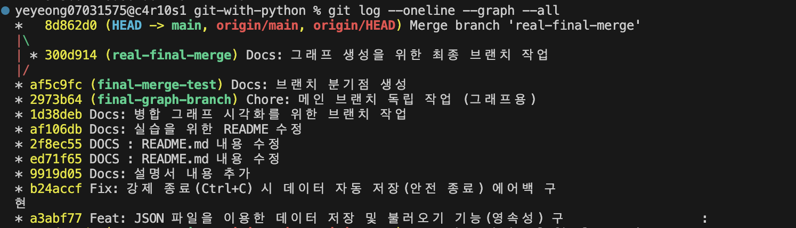

#  나만의 K-pop 퀴즈 게임 

파이썬을 활용하여 제작한 터미널 기반의 대화형 퀴즈 프로그램입니다. 
K-pop 아티스트와 곡에 대한 지식을 테스트하고, 사용자가 직접 퀴즈를 확장해 나갈 수 있도록 설계되었습니다.

##  프로젝트 개요
본 프로젝트는 프로그래밍 기초 역량인 **데이터 입출력, 예외 처리, 객체 지향 프로그래밍(OOP)** 및 **버전 관리(Git)** 능력을 실습할 수 았었습니다. 
단순한 퀴즈 풀이를 넘어, 데이터를 파일로 저장하고 불러오는 영속성 기능을 갖추도록 하였습니다. 

##  퀴즈 주제와 선정 이유
* **주제:** K-pop
* **선정 이유:**  대중적이고 흥미로운 주제를 통해 프로그램의 접근성을 높였습니다.

##  실행 방법
터미널(Terminal)에서 프로젝트 폴더로 이동한 후 아래 명령어를 입력합니다.
```bash
python main.py
```

##  기능 목록
1.  **퀴즈 풀기 (Play Quiz)**: 등록된 퀴즈를 무작위로 풀고, 정답 유무와 최종 점수를 확인합니다.
2.  **퀴즈 추가 (Add Quiz)**: 새로운 문제, 선택지(4지선다), 정답 번호를 입력하여 퀴즈 데이터베이스를 확장합니다.
3.  **목록 보기 (Show List)**: 현재 저장된 모든 퀴즈의 질문 리스트를 한눈에 확인합니다.
4.  **최고 점수 확인 (Show Best Score)**: 역대 기록 중 가장 높았던 정답 개수를 확인합니다.
5.  **데이터 자동 저장 및 로드**: 게임을 종료해도 퀴즈와 점수가 유지됩니다.
6.  **사용자 입력 예외 처리**: 숫자가 아닌 값, 범위 밖의 숫자, 빈 칸 입력 등을 방어하여 프로그램 중단을 방지합니다.
7.  **안전 종료 기능**: `Ctrl+C` 등을 통한 강제 종료 시에도 현재 데이터를 안전하게 저장하고 종료합니다.

##  파일 구조
```text
git-with-python/
├── main.py          # 게임 로직, 퀴즈 관리 클래스 및 실행 메인 루프
├── state.json       # 퀴즈 데이터 및 최고 점수가 저장되는 JSON 장부
├── .gitignore       # Git 관리에서 제외할 설정 및 캐시 파일 목록
└── README.md        # 프로젝트 설명서
```

##  데이터 파일 설명 (state.json)
프로그램은 모든 데이터를 루트 디렉토리의 `state.json` 파일에서 관리합니다.

* **경로:** `./state.json`
* **역할:** 프로그램 종료 시 현재 상태(최고 점수, 퀴즈 목록)를 영구적으로 저장하고, 시작 시 이를 복구합니다.
* **데이터 스키마(Schema):**
```json
{
    "best_score": 5,
    "quizzes": [
        {
            "question": "문제 내용 (문자열)",
            "choices": ["보기1", "보기2", "보기3", "보기4"],
            "answer": 1
        }
    ]
}
```

## clone 과 pull 실습 흔적
 "Docs: 복제된 저장소에서 README 내용 추가"

## git log --oneline --graph 결과
 
## git log --oneline | wc -l 결과


> 의미있는 기능을 구현할 때마다 총 20회 이상의 커밋을 남겼음.

##  기술적 설계 및 구현 상세 (Technical Documentation)

본 프로젝트의 완성도와 유지보수성을 높이기 위해 적용된 기술적 결정 사항들을 정리합니다.

---

### 1. 프로그램 구조 및 설계 

* **객체 지향 프로그래밍(OOP) 적용 이유:**
    * 함수 기반 구현 시 발생할 수 있는 데이터 전달의 복잡성과 전역 변수 남용을 방지하기 위해 클래스를 사용했습니다.
    * 클래스는 **데이터(상태)**와 **메서드(동작)**를 하나의 단위로 묶어(캡슐화), 코드의 독립성을 확보하고 재사용성을 높여줍니다.
* **클래스 간 책임 분리:**
    * `Quiz`: 퀴즈 한 장의 정보(질문, 보기, 정답)를 정의하는 데이터 구조체 역할에 집중합니다.
    * `QuizGame`: 전체적인 게임 흐름 제어, 사용자 인터페이스 제공, 파일 입출력 등 시스템 전반의 운영을 담당합니다.
* **로직 분리 기준:**
    * 코드의 가독성을 위해 **입력 처리(검증), 게임 진행, 데이터 관리** 로직을 별도의 메서드로 분리했습니다. 이는 특정 기능 수정 시 다른 기능에 영향을 주지 않는 '관심사의 분리'를 실천하기 위함입니다.

---

### 2. 데이터 관리 및 파일 시스템 

* **JSON 파일 형식을 선택한 이유:**
    * 파이썬의 딕셔너리/리스트 구조와 1:1로 매핑되어 직렬화 및 역직렬화가 매우 간편합니다.
    * 순수 텍스트 기반으로 사람이 읽고 수정하기 쉬우며, 범용적인 데이터 교환 표준이기 때문입니다.
* **데이터 스키마 설계 이유:**
    * 최상위 계층을 딕셔너리(`{ }`)로 구성하여 단일 데이터(`best_score`)와 목록 데이터(`quizzes`)를 효과적으로 통합했습니다. 퀴즈 내부 또한 딕셔너리 구조를 사용하여 질문과 정답 간의 연관 관계를 명확히 했습니다.
* **프로그램 내부 데이터 흐름:**
    1.  **로드:** 프로그램 시작 시 `load_data`가 실행되어 JSON 파일을 읽고 메모리에 객체 리스트를 생성합니다.
    2.  **갱신:** 퀴즈 추가 혹은 최고 점수 달성 시 즉시 `save_data`가 실행되어 파일에 저장됩니다.
    3.  **저장:** 프로그램 종료 혹은 `Ctrl+C` 감지 시 에외 처리를 통해 마지막으로 최신 상태를 파일에 기록합니다.
* **파일 입출력 예외 처리 (`try/except`):**
    * 파일이 존재하지 않거나(`FileNotFoundError`), 데이터가 손상되어 읽을 수 없는 경우에도 프로그램이 멈추지 않고 기본 데이터로 복구하여 실행될 수 있도록 안정성을 확보했습니다.

---

### 3. Git 전략 및 협업 규칙 

* **브랜치 분리 및 병합(Merge)의 의미:**
    * `main` 브랜치의 안정성을 보장하기 위해, 새로운 기능은 별도의 브랜치에서 개발 및 테스트를 거친 후 병합했습니다. 이는 실무 협업 환경에서 코드 충돌을 방지하고 작업 단위를 명확히 하는 필수적인 과정입니다.
* **커밋 메시지 작성 규칙:**
    * `Feat:`: 새로운 기능 구현
    * `Fix:`: 버그 및 오타 수정, 예외 처리 강화
    * `Docs:`: 문서 작성 및 수정
    * 의미 있는 기능 단위로 커밋을 세분화하여 작업 이력 추적을 용이하게 했습니다.

---

### 4. 확장성 및 유지보수성 

* **기술적 한계와 개선 방안:**
    * 현재의 JSON 방식은 데이터 증가 시 파일 전체를 읽고 써야 하므로 **메모리 및 I/O 성능 저하**가 발생할 수 있습니다. 데이터가 1,000개 이상으로 확장될 경우 SQLite와 같은 관계형 데이터베이스(RDBMS) 도입이 필요합니다.
* **데이터 보호 및 복구:**
    * `state.json` 파일 손상 시 `JSONDecodeError`를 포착하여 시스템이 강제 종료되는 것을 막고, 자동으로 기본 퀴즈 데이터를 생성 및 저장하여 **사용자 데이터 손실을 최소화하고 서비스 연속성을 유지**합니다.
* **요구사항 변경 시 수정 지점:**
    * **채점 방식 변경:** `QuizGame.play_quiz()` 메서드의 조건문 수정.
    * **퀴즈 구조(선택지 개수 등) 변경:** `Quiz` 클래스의 생성자와 `QuizGame.add_quiz()` 내 입력 로직 수정.
